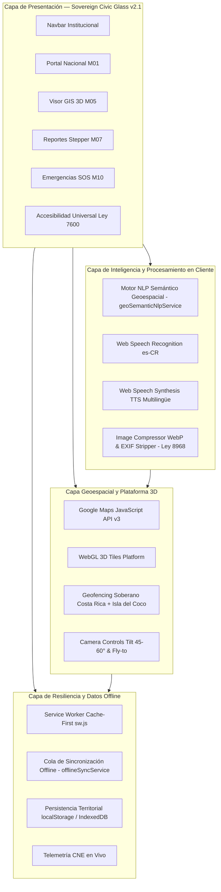
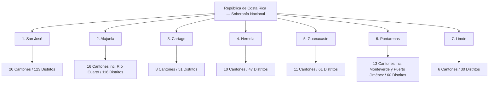

# Costa Rica Unidos — Plataforma Territorial Soberana

[](https://react.dev/)
[](https://costaricaunidos.cr)
[](https://inec.cr)
[](https://costaricaunidos.cr)
[](https://www.w3.org/WAI/WCAG21/quickref/)
[](https://pgrweb.go.cr)
[](https://web.dev/progressive-web-apps/)

Plataforma digital integral para la soberanía ciudadana, transparencia presupuestaria, fiscalización de obra pública, resiliencia ante emergencias nacionales, navegación territorial tridimensional e internacionalización reactiva en la República de Costa Rica.

---

## 📑 Tabla de Contenidos

1. [Visión General del Proyecto](#1-visión-general-del-proyecto)
2. [Módulos Cívicos Implementados](#2-módulos-cívicos-implementados)
   - [Módulo 01: Portal Nacional y Theming Soberano](#módulo-01-portal-nacional-y-theming-soberano)
   - [Módulo 05: Sistema GIS y Visor Cartográfico 3D Soberano](#módulo-05-sistema-gis-y-visor-cartográfico-3d-soberano)
   - [Módulo 07: Sistema de Reportes Ciudadanos e Incidencias Viales](#módulo-07-sistema-de-reportes-ciudadanos-e-incidencias-viales)
   - [Módulo 10: Seguridad Ciudadana, Gestión del Riesgo y Modo Resiliencia Offline](#módulo-10-seguridad-ciudadana-gestión-del-riesgo-y-modo-resiliencia-offline)
   - [Módulo 12 / RF-12.1: Búsqueda Semántica Geoespacial con NLP y Voz](#módulo-12--rf-121-búsqueda-semántica-geoespacial-con-nlp-y-voz)
   - [Motor de Accesibilidad Universal (RNF-05 / Ley N° 7600)](#motor-de-accesibilidad-universal-rnf-05--ley-n-7600)
3. [Arquitectura del Sistema y Flujo de Datos](#3-arquitectura-del-sistema-y-flujo-de-datos)
4. [Estructura del Proyecto](#4-estructura-del-proyecto)
5. [Jerarquía Territorial Oficial de Costa Rica](#5-jerarquía-territorial-oficial-de-costa-rica)
6. [Sistema de Diseño: Sovereign Civic Glass v2.1](#6-sistema-de-diseño-sovereign-civic-glass-v21)
7. [Matriz de Personas: Eiker vs Alanie](#7-matriz-de-personas-eiker-vs-alanie)
8. [Instalación y Puesta en Marcha](#8-instalación-y-puesta-en-marcha)
9. [Gobernanza, DevOps y Flujo GitFlow](#9-gobernanza-devops-y-flujo-gitflow)
10. [Marco Normativo y Cumplimiento Legal](#10-marco-normativo-y-cumplimiento-legal)

---

## 1. Visión General del Proyecto

**Costa Rica Unidos** es una suite tecnológica de ingeniería de software cívico concebida para cerrar la brecha entre la ciudadanía y las instituciones del Estado. Su objetivo primordial es brindar un entorno unificado, accesible, auditable y transparente donde converjan:

- **Fiscalización ciudadana activa**: Trazabilidad y seguimiento en tiempo real de licitaciones, avance de obras públicas e incidencias viales.
- **Navegación territorial fotorrealista**: Modelado 3D interactivo del relieve nacional, volcanes, valles y cordilleras con geocercado perimetral estricto.
- **Resiliencia ante emergencias nacionales**: Botonera táctil SOS de acceso instantáneo, cintillo oficial de telemetría de alertas de la Comisión Nacional de Emergencias (CNE) y soporte offline total garantizado mediante Progressive Web Apps (PWA).
- **Inteligencia artificial cívica y accesibilidad universal**: Procesamiento de lenguaje natural costarricense en cliente, dictado por voz y lectura de pantalla multilingüe con soporte para lenguas indígenas autóctonas.

---

## 2. Módulos Cívicos Implementados

### Módulo 01: Portal Nacional y Theming Soberano
- **Ruta**: `/` e `/inicio`
- **Capacidades**:
  - **Theming Engine Provincial Dinámico**: Inyección de tokens cromáticos `--province-primary` y `--glow-provincial` según la provincia activa, reflejando las identidades cantonales y patrias.
  - **Selector Territorial en Cascada (DTA Oficial)**: Despliegue anidado de `Provincia` ➔ `Cantón` (84 cantones, incluyendo Río Cuarto, Monteverde y Puerto Jiménez) ➔ `Distrito` (492 distritos), con persistencia automática en `localStorage`.
  - **Hero Carousel Tricolor**: Carrusel institucional interactivo accesible con controles de pausa, telemetría técnica en vivo y enlaces rápidos a servicios cívicos.
  - **Cajón Flotante Territorial (Drawer)**: Exploración rápida de códigos postales y datos demográficos por distrito.
  - **Búsqueda Predictiva con Atajo de Teclado**: Acceso global mediante `Ctrl + K`.
  - **Sistema de Internacionalización Reactiva (8 Idiomas Oficiales)**:
    * Selector dinámico integrado en el menú a pantalla completa (`FullScreenMenu.jsx`) con soporte para 8 banderas e idiomas: `CR` (Español Costa Rica), `ES` (Español España), `US` (Inglés), `CN` (Chino Mandarín), `BR` (Portugués), `FR` (Francés), `RU` (Ruso) y `JP` (Japonés).
    * Traducción en tiempo real sin recarga de página del Hero, buscador semántico, botón de exploración, los 11 módulos nacionales y las métricas territoriales (`07 Provincias`, `84 Cantones`, `492 Distritos`).
    * Persistencia automática de la preferencia lingüística en `localStorage` (`idioma_preferido`).
    * Sincronización bidireccional inmediata con el motor de voz asistida Web Speech API TTS (`VoiceReaderFloatingButton.jsx`).

### Módulo 05: Sistema GIS y Visor Cartográfico 3D Soberano
- **Ruta**: `/mapa-gis`
- **Capacidades**:
  - **Google Maps JavaScript API v3 (WebGL / 3D Platform)**: Renderizado fotorrealista con texturizado de relieve, volcanes y topografía nacional.
  - **Geofencing Soberano Estricto**: Restricción matemática infranqueable (`restriction.latLngBounds`) que limita el paneo y cámara a las fronteras terrestres y aguas patrimoniales de Costa Rica (incluyendo la delimitación insular de la Isla del Coco: Lat 5.53°, Lng -87.07°).
  - **Controles de Cámara 3D y Vuelos Órbita**: Inclinación variable (tilt 45°-60°), rotación azimutal y animaciones suaves (*fly-to*) hacia cualquier provincia seleccionada.
  - **Panel Multicapa Flotante de 5 Dimensiones Cívicas**:
    1. 🏥 *Salud*: EBAIS, Clínicas Integradas y Hospitales de la CCSS.
    2. 👮 *Seguridad*: Comisarías y Delegaciones de la Fuerza Pública.
    3. 🛡️ *Gestión del Riesgo*: Albergues temporales oficiales de la CNE.
    4. 🎓 *Educación*: Colegios Técnicos, Escuelas y Liceos del MEP.
    5. 🚧 *Infraestructura Vial*: Proyectos de obra y rutas nacionales MOPT / CONAVI.
  - **Tarjetas de Detalle Modal con Deep-Linking**: Telemetría técnica en tipografía `JetBrains Mono` con enlaces directos a Waze y Google Maps.

### Módulo 07: Sistema de Reportes Ciudadanos e Incidencias Viales
- **Ruta**: `/reportar-incidencia`
- **Capacidades**:
  - **Asistente Guiado de 4 Pasos (Stepper)**:
    - *Paso 1 (Tipología del Daño)*: Selección visual de categoría (Hueco vial/bache en asfalto, Luminaria pública apagada o dañada, Fuga de agua potable/alcantarilla colapsada, Basurero clandestino).
    - *Paso 2 (Evidencia Fotográfica y Privacidad)*: Captura de fotos con selector de archivo o cámara, previsualización interactiva y consentimiento de protección de datos.
    - *Paso 3 (Georreferenciación Exacta)*: Selección de ubicación interactiva con pin GPS sobre mapa cartográfico y selector distrital.
    - *Paso 4 (Confirmación y Radicado)*: Resumen formal, emisión de identificador cívico `CR-2026-XXXX` y generación de comprobante.
  - **Compresión de Imágenes en Cliente (< 1 MB)**: Conversión automática al estándar WebP en `imageCompressor.js`.
  - **Sanitización Forzosa de Metadatos EXIF (Ley N° 8968)**: Destrucción de metadatos GPS satelitales y de identificación de cámara en Canvas antes de almacenar o transferir datos.
  - **Tablero de Trazabilidad de Tickets (Kanban)**: Monitoreo transparente en 4 fases (*En Revisión*, *Asignado*, *En Cuadrilla*, *Resuelto*) con buscador por radicado y exportación a PDF/JSON.

### Módulo 10: Seguridad Ciudadana, Gestión del Riesgo y Modo Resiliencia Offline
- **Ruta**: `/seguridad-emergencias`
- **Capacidades**:
  - **Botonera Táctil SOS a Pantalla Completa**: Botones táctiles de gran formato ($\ge 54\text{px}$) con contraste ultra-alto y marcado telefónico directo mediante enlaces nativos `tel:` para:
    - `9-1-1`: Sistema de Emergencias Generales.
    - `Fuerza Pública`: Policía del Ministerio de Seguridad Pública.
    - `Bomberos`: Benemérito Cuerpo de Bomberos de Costa Rica.
    - `Cruz Roja`: Benemérita Cruz Roja Costarricense.
    - `OIJ`: Organismo de Investigación Judicial.
  - **Cintillo Oficial de Telemetría de Alertas CNE**: Telemetría en vivo con los cuatro niveles oficiales de la Comisión Nacional de Emergencias: Verde (Informativa), Amarilla (Precaución), Naranja (Peligro Inminente) y Roja (Evacuación Obligatoria).
  - **Directorio y Aforo de Albergues Temporales CNE**: Catálogo interactivo de albergues habilitados con indicación de capacidad máxima, personas albergadas y barra dinámica de aforo disponible.
  - **Arquitectura PWA Offline-First**:
    - Service Worker manual (`public/sw.js`) con estrategia Cache-First para recursos estáticos y assets cartográficos.
    - Gestor de sincronización offline (`offlineSyncService.js`): Almacenamiento seguro de reportes en cola local para sincronización diferida automática al restablecerse la red.

### Módulo 12 / RF-12.1: Búsqueda Semántica Geoespacial con NLP y Voz
- **Componentes**: `src/components/gis/SemanticGeoSearchBar.jsx` y `src/services/geoSemanticNlpService.js`
- **Capacidades**:
  - **Pipeline de Procesamiento de Lenguaje Natural en Cliente**:
    - Tokenización, normalización fonética y análisis semántico de consultas cívicas en español costarricense (ej. *"clínicas cerca de colegios técnicos en San Carlos"*, *"albergues habilitados si se inunda Parrita"*, *"bretes viales en Cartago"*).
    - Extracción instantánea de entidades geográficas (84 cantones, 7 provincias, distritos) y clasificación de capas temáticas requeridas.
  - **Dictado por Voz Accesible**: Integración con Web Speech API (`webkitSpeechRecognition`) configurado en dialecto costarricense (`es-CR`).
  - **Transición Cartográfica 3D Reactiva**: Vuelo de cámara animado (*fly-to*) hacia las coordenadas extraídas y activación de resplandor visual temático (`--glow-provincial`).
  - **Cajón Flotante de Resultados**: Despliegue lateral (`NlpResultsDrawer.jsx`) con tarjetas de puntos de interés filtrados, distancias y botones de navegación.

### Motor de Accesibilidad Universal (RNF-05 / Ley N° 7600)
- **Componentes**: `src/components/accessibility/`
- **Capacidades**:
  - **Selector de Escala Tipográfica en 4 Fases**:
    * *Fase 1*: 100% (Tamaño estándar).
    * *Fase 2*: 125% (Lectura cómoda).
    * *Fase 3*: 150% (Adultos mayores o baja visión leve).
    * *Fase 4*: 200% (Máxima accesibilidad visual, donde las áreas táctiles crecen automáticamente a un mínimo de 64px de alto).
    * Inyección de variable CSS `--text-scale` sin desbordamiento horizontal en pantallas móviles (360px de ancho).
  - **Sintetizador de Voz y Lector de Pantalla Flotante**:
    * Web Speech API (`SpeechSynthesis`) con soporte para 8 idiomas: Español, Bribri, Cabécar, Maleku, Guaymí, Inglés, Francés y Mandarín.
    * Conmutación entre voces femenina y masculina.
  - **Inducción Interactiva Guiada por Voz**: Modal de inducción en 3 pasos con locución de bienvenida y transcripción sincronizada de subtítulos en vivo.

---

## 3. Arquitectura del Sistema y Flujo de Datos



---

## 4. Estructura del Proyecto

```text
CostaRicaUnidos-Plataforma-Web-Integral/
├── .env                              # Variables de entorno locales (API keys)
├── .env.example                      # Plantilla de variables de entorno requeridas
├── .gitignore                        # Exclusiones de Git (node_modules, dist, .env)
├── Agent.md                          # Directrices de gobernanza cívica y memoria de IA
├── CHANGELOG.md                      # Registro de cambios formal (Keep a Changelog / SemVer)
├── CONTRIBUTING.md                   # Guía de contribución, GitFlow y estándares cívicos
├── index.html                        # Punto de entrada HTML5 con metadatos de SEO y PWA
├── package.json                      # Configuración de dependencias y scripts de npm
├── README.md                         # Documentación técnica maestra del proyecto
├── SECURITY.md                       # Políticas de ciberseguridad y cumplimiento Ley N° 8968
├── vite.config.js                    # Configuración de empaquetado y plugins de Vite
├── public/
│   ├── favicon.ico                   # Favicon clásico multiplataforma
│   ├── favicon.svg                   # Favicon vectorial con isotipo transparente
│   ├── logo.png                      # Isotipo oficial de alta resolución con transparencia
│   ├── manifest.webmanifest          # Manifiesto de aplicación PWA (instalabilidad)
│   └── sw.js                         # Service Worker con estrategia de caché offline
└── src/
    ├── App.jsx                       # Componente orquestador con Language y Accessibility Providers
    ├── main.jsx                      # Punto de renderizado en el DOM de React 18
    ├── index.css                     # Sistema de estilos Sovereign Civic Glass v2.1
    ├── serviceWorkerRegistration.js  # Registro y control de ciclo de vida del Service Worker
    ├── components/
    │   ├── FullScreenMenu.jsx        # Menú overlay con selector de 8 idiomas y 11 módulos
    │   ├── HeroCarousel.jsx          # Carrusel institucional tricolor
    │   ├── InteractiveSvgMap.jsx     # Mapa vectorial provincial SVG
    │   ├── Navbar.jsx                # Barra de navegación cívica con accesibilidad
    │   ├── PredictiveSearch.jsx      # Búsqueda territorial predictiva (Ctrl + K)
    │   ├── ProvincialThemeEngine.jsx # Inyector dinámico de tokens cromáticos provinciales
    │   ├── TerritorialDrawer.jsx     # Cajón deslizante de datos distritales
    │   ├── TerritorialSelector.jsx   # Selector en cascada (Provincia ➔ Cantón ➔ Distrito)
    │   ├── accessibility/            # Motor de accesibilidad universal (Ley 7600)
    │   │   ├── AccessibilityContext.jsx
    │   │   ├── TypographicScaleSelector.jsx
    │   │   ├── VoiceGuidedOnboardingModal.jsx
    │   │   ├── VoiceReaderFloatingButton.jsx
    │   │   ├── accessibilityData.js
    │   │   └── index.js
    │   ├── common/                   # Componentes comunes de diseño
    │   │   └── Logo.jsx              # Logotipo oficial (Isotipo + Wordmark, máx. 40px)
    │   ├── gis/                      # Visor cartográfico 3D y búsqueda NLP (M05 / M12)
    │   │   ├── CameraFlyControls.jsx
    │   │   ├── LayerControlPanel.jsx
    │   │   ├── MapaCartografico3D.jsx
    │   │   ├── NlpResultsDrawer.jsx
    │   │   ├── PointDetailCard.jsx
    │   │   ├── SemanticGeoSearchBar.jsx
    │   │   ├── darkMapStyles.js
    │   │   ├── gisLayersData.js
    │   │   └── index.js
    │   ├── reports/                  # Reportes de incidencias viales y tickets (M07)
    │   │   ├── Step1DamageType.jsx
    │   │   ├── Step2PhotoPrivacy.jsx
    │   │   ├── Step3Georeferencing.jsx
    │   │   ├── Step4Confirmation.jsx
    │   │   ├── TicketTraceabilityBoard.jsx
    │   │   ├── imageCompressor.js
    │   │   ├── ticketService.js
    │   │   └── index.js
    │   └── security/                 # Centro de seguridad, alertas SOS y CNE (M10)
    │       ├── AlberguesListMap.jsx
    │       ├── CneAlertRibbon.jsx
    │       ├── OfflineResilienceManager.jsx
    │       ├── SosKeypadFullscreen.jsx
    │       └── index.js
    ├── context/
    │   └── LanguageContext.jsx       # Contexto y diccionario reactivo para 8 idiomas oficiales
    ├── data/
    │   └── territorialData.js        # DTA oficial: 7 provincias, 84 cantones, distritos
    ├── pages/
    │   ├── Dashboard.jsx             # Tablero de métricas cívicas
    │   ├── Inicio.jsx                # Portal de bienvenida y navegación provincial
    │   ├── Login.jsx                 # Acceso institucional autenticado
    │   ├── MapaGIS.jsx               # Página principal del visor cartográfico 3D
    │   ├── NotFound.jsx              # Vista de error 404 institucional
    │   ├── ReportarIncidencia.jsx    # Asistente y trazabilidad de reportes viales
    │   └── SeguridadEmergencias.jsx  # Centro de resiliencia y emergencias SOS
    ├── routes/
    │   └── Routing.jsx               # Declaración de rutas con React Router DOM v6
    └── services/
        ├── geoSemanticNlpService.js  # Motor NLP de búsqueda geoespacial semántica
        ├── offlineSyncService.js     # Gestor de cola y sincronización diferida
        └── ubicacionesService.js     # Proveedor de jerarquía territorial DTA
```

---

## 5. Jerarquía Territorial Oficial de Costa Rica

La plataforma implementa con fidelidad absoluta la **División Territorial Administrativa (DTA)** oficial según las clasificaciones del Instituto Nacional de Estadística y Censos (INEC) y el Tribunal Supremo de Elecciones (TSE).



---

## 6. Sistema de Diseño: Sovereign Civic Glass v2.1

**Sovereign Civic Glass v2.1** es una evolución estética del *glassmorphism* concebida para plataformas estatales de alta confianza, transparencia semántica y legibilidad a la intemperie:

### Tríadas Cromáticas Provinciales:
| Provincia | Identidad Territorial | Token `--province-primary` | Token Secundario | Token Acento |
| :--- | :--- | :--- | :--- | :--- |
| **San José** | Saprissa / Metrópoli | `#601438` | `#FFFFFF` | `#1A1F36` |
| **Alajuela** | Liga Deportiva Alajuelense (LDA) | `#D31424` | `#111111` | `#FFFFFF` |
| **Heredia** | Club Sport Herediano (CSH) | `#FFC700` | `#D61B23` | `#181818` |
| **Cartago** | Club Sport Cartaginés (CSC) | `#0A3282` | `#FFFFFF` | `#3572C6` |
| **Guanacaste** | Asociación Deportiva Guanacasteca (ADG) | `#05853B` | `#DE1C24` | `#FFFFFF` |
| **Puntarenas** | Puntarenas F.C. (PFC) | `#F36717` | `#121212` | `#FFFFFF` |
| **Limón** | Limón F.C. / La Tromba del Caribe | `#349E35` | `#FFFFFF` | `#D89F18` |

### Niveles de Vidrio Esmerilado:
- **Nivel 1 (Superficie Base)**: `rgba(0, 16, 102, 0.65)` | `backdrop-filter: blur(16px)` | borde translúcido (12%).
- **Nivel 2 (Paneles Flotantes / Drawers)**: `rgba(0, 20, 137, 0.55)` | `backdrop-filter: blur(24px)` | borde translúcido (20%).
- **Nivel 3 (Modales Críticos / Diálogos SOS)**: `rgba(0, 8, 30, 0.85)` | `backdrop-filter: blur(32px)` | borde translúcido (28%).

---

## 7. Matriz de Personas: Eiker vs Alanie

| Dimensión | Eiker (El Auditor Tecnológico) | Alanie (La Emprendedora Comunitaria) |
| :--- | :--- | :--- |
| **Rol Cívico** | Auditor social, ingeniero de datos, fiscalizador de compras públicas | Pequeña comerciante local, líder vecinal de distrito |
| **Dispositivo Principal** | Estación de trabajo Desktop (múltiples monitores, alta resolución) | Smartphone (conexión móvil 4G/5G, pantalla táctil) |
| **Nivel Técnico** | Avanzado (analiza esquemas JSON, presupuestos y modelos 3D) | Práctico / Cotidiano (valora la inmediatez, simplicidad y claridad) |
| **Caso de Uso Primario** | Comparar costo de licitación pública vs avance físico volumétrico | Reportar incidentes en su calle y consultar centros de auxilio |
| **Uso de Google Maps 3D** | Inspección de malla 3D de obras públicas, pendientes y cuencas | Ubicar albergues CNE, EBAIS y comisarías de policía |
| **Tolerancia a Fricción** | Media (dispuesto a usar filtros complejos y telemetría avanzada) | Nula (requiere acciones inmediatas a 1 toque en emergencias) |

---

## 8. Instalación y Puesta en Marcha

### Prerrequisitos
- **Node.js**: Versión 18.x LTS o superior.
- **npm**: Versión 9.x o superior.
- **Google Maps API Key**: Con las APIs *Maps JavaScript API* y *Geocoding API* habilitadas.

### Instrucciones de Instalación
1. Clonar el repositorio y acceder al directorio:
   ```bash
   git clone https://github.com/tu-organizacion/CostaRicaUnidos-Plataforma-Web-Integral.git
   cd CostaRicaUnidos-Plataforma-Web-Integral
   ```

2. Cambiar a la rama de desarrollo activo:
   ```bash
   git checkout feature/Eiker
   ```

3. Instalar dependencias del proyecto:
   ```bash
   npm install
   ```

4. Configurar las variables de entorno:
   Copie el archivo `.env.example` a `.env` y agregue su clave:
   ```bash
   cp .env.example .env
   ```
   *Contenido de `.env`:*
   ```env
   VITE_GOOGLE_MAPS_API_KEY=tu_clave_de_google_maps_aqui
   ```

5. Iniciar el servidor local de desarrollo:
   ```bash
   npm run dev
   ```
   La aplicación se abrirá en `http://localhost:5173/`.

6. Validar compilación de producción:
   ```bash
   npm run build
   ```

7. Previsualizar la compilación de producción:
   ```bash
   npm run preview
   ```

---

## 9. Gobernanza, DevOps y Flujo GitFlow

El proyecto implementa una disciplina estricta de control de versiones y gobernanza:

- **[Agent.md](file:///c:/Users/abark/OneDrive/Documentos/OneDrive/Escritorio/Proyecto%20final-CostaRicaViva/CostaRicaUnidos-Plataforma-Web-Integral/Agent.md)**: Manual operativo de contexto e instrucciones acumulativas para asistentes de Inteligencia Artificial.
- **[CHANGELOG.md](file:///c:/Users/abark/OneDrive/Documentos/OneDrive/Escritorio/Proyecto%20final-CostaRicaViva/CostaRicaUnidos-Plataforma-Web-Integral/CHANGELOG.md)**: Registro histórico formal de versiones siguiendo los estándares de *Keep a Changelog* y *SemVer 2.0.0*.
- **[CONTRIBUTING.md](file:///c:/Users/abark/OneDrive/Documentos/OneDrive/Escritorio/Proyecto%20final-CostaRicaViva/CostaRicaUnidos-Plataforma-Web-Integral/CONTRIBUTING.md)**: Guía detallada para desarrolladores, reglas de commits convencionales, plantillas de Pull Request y estándares de accesibilidad.
- **[SECURITY.md](file:///c:/Users/abark/OneDrive/Documentos/OneDrive/Escritorio/Proyecto%20final-CostaRicaViva/CostaRicaUnidos-Plataforma-Web-Integral/SECURITY.md)**: Protocolo de divulgación coordinada de vulnerabilidades y políticas de protección de datos personales.

---

## 10. Marco Normativo y Cumplimiento Legal

| Ley o Estándar | Alcance en la Plataforma | Mecanismo de Verificación Técnica |
| :--- | :--- | :--- |
| **Ley N° 7600** | Igualdad de oportunidades y accesibilidad universal | Escala tipográfica en 4 fases (--text-scale), áreas táctiles $\ge 54\text{px}$/$\ge 64\text{px}$ y lector TTS en 8 idiomas |
| **Ley N° 8968** | Protección de la persona y sus datos personales | Sanitización forzosa en Canvas que elimina metadatos EXIF / GPS satelitales en `imageCompressor.js` |
| **WCAG 2.1 AA** | Pautas internacionales de accesibilidad web | Ratios de contraste $\ge 4.5:1$, navegación total por teclado y atributos ARIA completos |
| **DTA Oficial** | Soberanía y delimitación territorial | Geofencing estricto de Costa Rica e Isla del Coco en Google Maps API y catálogo de 84 cantones |

---

*Desarrollado con rigor técnico, vocación patriótica y soberanía digital para el pueblo de la República de Costa Rica.*
