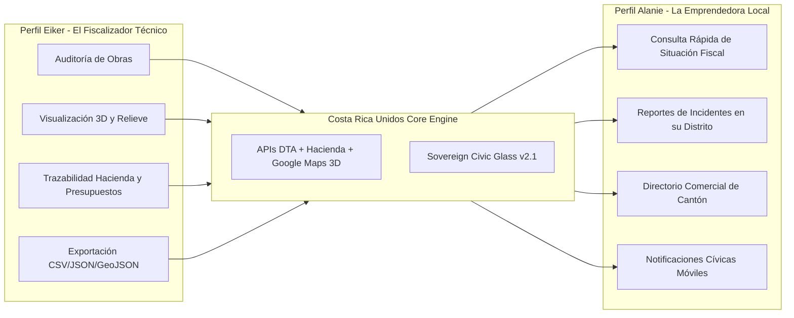
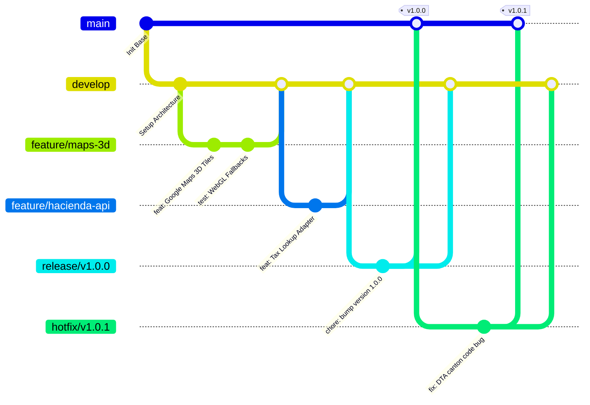

# Costa Rica Unidos — Plataforma Web Integral

[](https://react.dev/)
[](https://costaricaunidos.cr)
[](https://inec.cr)
[](https://git-scm.com/)

Plataforma digital integral para la soberanía ciudadana, transparencia presupuestaria, fiscalización de obra pública y gestión territorial comunitaria en la República de Costa Rica.

---

## Índice

1. [Visión General del Proyecto](#1-visión-general-del-proyecto)
2. [Estructura del Proyecto y Arquitectura Frontend](#2-estructura-del-proyecto-y-arquitectura-frontend)
3. [Jerarquía Territorial Oficial de Costa Rica](#3-jerarquía-territorial-oficial-de-costa-rica)
4. [Sistema de Diseño: Sovereign Civic Glass v2.1](#4-sistema-de-diseño-sovereign-civic-glass-v21)
5. [Matriz Comparativa de Personas: Eiker vs Alanie](#5-matriz-comparativa-de-personas-eiker-vs-alanie)
6. [Integración de APIs y Servicios de Datos](#6-integración-de-apis-y-servicios-de-datos)
7. [Estrategia DevOps y Flujo de Ramas de Git](#7-estrategia-devops-y-flujo-de-ramas-de-git)
8. [Archivos de Soporte y Gobernanza](#8-archivos-de-soporte-y-gobernanza)

---

## 1. Visión General del Proyecto

**Costa Rica Unidos** nace como una solución de ingeniería de software cívico concebida para cerrar la brecha entre la ciudadanía y las instituciones del Estado. Su objetivo primordial es brindar un entorno unificado, accesible, auditatorio y transparente donde converjan:

- **Fiscalización ciudadana activa**: Seguimiento de licitaciones, avance físico y presupuestario de obras públicas.
- **Consultas tributarias y comerciales**: Verificación de situación fiscal ante el Ministerio de Hacienda y fomento del comercio local.
- **Navegación territorial fotorrealista**: Modelado 3D interactivo del relieve nacional, cuencas, cantones e infraestructura mediante tecnologías geoespaciales de vanguardia.
- **Participación comunitaria**: Canal directo para reportes barriales, alertas distritales y asambleas cívicas digitales.

---

## 2. Estructura del Proyecto y Arquitectura Frontend

El proyecto adopta una arquitectura modular desacoplada basada en componentes bajo el estándar SPA con React:

```text
CostaRicaUnidos-Plataforma-Web-Integral/
├── .gitignore               # Reglas de exclusión para Git (node_modules, dist, env, etc.)
├── Agent.md                 # Guía de directrices y contexto para agentes de Inteligencia Artificial
├── CHANGELOG.md             # Registro cronológico de versiones y cambios (Keep a Changelog)
├── CONTRIBUTING.md          # Guía de contribución, estándares de código y flujo de trabajo
├── index.html               # Documento raíz HTML5 optimizado para accesibilidad y SEO cívico
├── README.md                # Especificación técnica exhaustiva del proyecto
├── SECURITY.md              # Políticas de reporte de vulnerabilidades y seguridad de datos
└── src/
    ├── App.jsx              # Componente raíz orquestador de layout, temas y proveedores
    ├── main.jsx             # Punto de entrada de renderizado en el DOM
    ├── components/          # Biblioteca de componentes atómicos y moleculares reutilizables
    ├── pages/               # Vistas principales organizadas por dominio cívico funcional
    └── routes/              # Definición de rutas, guardias de navegación y lazy loading
```

### Principios Arquitectónicos
- **Separación de responsabilidades**: Componentes puramente visuales encapsulados en `src/components/`, lógica de página en `src/pages/`, enrutamiento declarativo en `src/routes/`.
- **Cero código de implementación prematuro**: La fase fundacional establece el andamiaje estructural, validación de enlaces y gobernanza antes de la inyección de dependencias y lógica de negocio.

---

## 3. Jerarquía Territorial Oficial de Costa Rica

La plataforma implementa la **División Territorial Administrativa (DTA)** oficial según las clasificaciones del Instituto Nacional de Estadística y Censos (INEC) y el Tribunal Supremo de Elecciones (TSE).


### Niveles Territoriales y Datos:
1. **Nivel 1 — Provincias (7)**:
   - `1`: San José | `2`: Alajuela | `3`: Cartago | `4`: Heredia
   - `5`: Guanacaste | `6`: Puntarenas | `7`: Limón
2. **Nivel 2 — Cantones (84)**:
   - Incorporación de los cantones de reciente fundación: **Río Cuarto** (Cantón 216 de Alajuela), **Monteverde** (Cantón 612 de Puntarenas) y **Puerto Jiménez** (Cantón 613 de Puntarenas).
3. **Nivel 3 — Distritos (492+)**:
   - Cada distrito cuenta con georreferenciación vectorial (polígonos GeoJSON) y código postal/DTA de 5 dígitos (`PPDDD`).

---

## 4. Sistema de Diseño: Sovereign Civic Glass v2.1

**Sovereign Civic Glass v2.1** es una evolución del glassmorphism diseñada específicamente para interfaces cívicas y gubernamentales de alta confiabilidad. Prioriza la transparencia semántica (el diseño refleja la transparencia del Estado), el confort visual y la conformidad estricta con las pautas de accesibilidad **WCAG 2.1 AA/AAA**.

### Paleta Cromática Institucional

| Token | Nombre | Valor Hex | HSL | Propósito y Aplicación |
| :--- | :--- | :--- | :--- | :--- |
| `--color-sovereign-blue` | Azul Soberano | `#002B7F` | `hsl(219, 100%, 25%)` | Cabeceras institucionales, navegación primaria, botones de acción estatal |
| `--color-civic-white` | Blanco Cívico | `#FFFFFF` | `hsl(0, 0%, 100%)` | Contraste de texto, fondos vítreos primarios, legibilidad universal |
| `--color-solidarity-red` | Rojo Solidario | `#CE1126` | `hsl(353, 85%, 44%)` | Alertas de fiscalización, botones de reporte, indicadores de auditoría crítica |
| `--color-biodiversity-green` | Verde Biodiversidad | `#007A3D` | `hsl(150, 100%, 24%)` | Proyectos ecológicos concluidos, estatus tributario al día, éxito de trámites |
| `--color-glass-surface` | Vidrio Cívico Claro | `rgba(255, 255, 255, 0.72)` | — | Tarjetas cívicas en modo diurno, modales flotantes |
| `--color-glass-dark` | Vidrio Cívico Nocturno | `rgba(10, 20, 40, 0.65)` | — | Fondos translúcidos en modo oscuro y superposiciones cartográficas 3D |

### Especificaciones de Textura y Refracción
- **Efecto de desenfoque de fondo**: `backdrop-filter: blur(16px) saturate(180%)`.
- **Bordes translúcidos**: `border: 1px solid rgba(255, 255, 255, 0.18)`.
- **Sombra volumétrica**: `box-shadow: 0 8px 32px 0 rgba(0, 43, 127, 0.12)`.
- **Tipografía base**: Sistema modular sans-serif (`Inter`, `Plus Jakarta Sans`, `-apple-system`, `system-ui`) optimizado para lectura en pantallas de bajo contraste ambiental o intemperie.

---

## 5. Matriz Comparativa de Personas: Eiker vs Alanie

Para garantizar que la arquitectura atienda tanto la fiscalización avanzada como la usabilidad comunitaria masiva, el sistema se diseña alrededor de dos arquetipos cívicos contrastantes:



### Tabla Comparativa de Requerimientos

| Dimensión | Eiker (El Auditor Tecnológico) | Alanie (La Emprendedora Comunitaria) |
| :--- | :--- | :--- |
| **Rol Cívico** | Auditor social, ingeniero de datos, fiscalizador de compras públicas | Pequeña comerciante local, líder vecinal de distrito |
| **Dispositivo Principal** | Estación de trabajo Desktop (múltiples monitores, alta resolución) | Smartphone (conexión móvil 4G/5G, pantalla táctil) |
| **Nivel Técnico** | Avanzado (analiza esquemas JSON, presupuestos y modelos 3D) | Práctico / Cotidiano (valora la inmediatez, simplicidad y claridad) |
| **Caso de Uso Primario** | Comparar costo de licitación pública vs avance físico volumétrico | Verificar estado tributario propio/proveedores y reportar huecos viales |
| **Uso de Google Maps 3D** | Inspección de malla 3D de obras públicas, pendientes y cuencas | Ubicar oficinas distritales, ferias del agricultor e incidentes barriales |
| **Interacción con Hacienda** | Análisis de ejecución presupuestaria de partidas por ministerio | Consulta rápida de cédula jurídica/física y validador de facturas |
| **Tolerancia a Fricción** | Media (dispuesto a usar filtros complejos y queries relacionales) | Nula (requiere acciones en 1 a 2 toques con confirmación visual) |
| **Métrica de Éxito UX** | Profundidad de datos disponibles y capacidad de exportación | Tiempo de resolución del trámite menor a 60 segundos |

---

## 6. Integración de APIs y Servicios de Datos

La plataforma interactúa con tres pilares de datos fundamentales:

### 1. Google Maps Photorealistic 3D Platform & WebGL
- **Propósito**: Renderizado tridimensional fotorrealista del territorio costarricense.
- **Capacidades**:
  - Visualización volumétrica de construcciones y proyectos de infraestructura vial nacional.
  - Proyección de curvas de nivel, riesgos de inundación y análisis topográfico por cantón.
  - Renderizado acelerado por hardware mediante WebGL con fallback a mapa vectorial estándar 2D en dispositivos de recursos limitados.

### 2. Ministerio de Hacienda (ATV y Comprobantes Electrónicos)
- **Propósito**: Verificación tributaria transparente y autenticación de contribuyentes.
- **Capacidades**:
  - Consulta pública de situación tributaria por número de identificación (Cédula Física, Cédula Jurídica, DIMEX, NITE).
  - Consulta de validez de comprobantes electrónicos (factura electrónica, tiquete electrónico, notas de crédito/débito).
  - Visualización de datos de recaudación y partidas presupuestarias autorizadas por la Contraloría General de la República.

### 3. API de Ubicaciones de Costa Rica (DTA / INEC)
- **Propósito**: Catálogo geográfico estructurado y normalizado.
- **Capacidades**:
  - Despliegue en cascada ultra-rápido: `Provincia` ➔ `Cantón` ➔ `Distrito`.
  - Capas GeoJSON optimizadas para cálculo de áreas, perímetros y delimitaciones censales.

---

## 7. Estrategia DevOps y Flujo de Ramas de Git

El equipo adopta una versión rigurosa y adaptada de **GitFlow** orientada a entregas continuas, seguridad de código y trazabilidad cívica.



### Convenciones de Ramas

| Tipo de Rama | Formato de Nomenclatura | Rama Origen | Rama Destino | Descripción |
| :--- | :--- | :--- | :--- | :--- |
| **Producción** | `main` | — | — | Código estable desplegado en producción. Protegida contra pushes directos. |
| **Integración** | `develop` | `main` | `main` | Rama de integración continua. Refleja los últimos desarrollos completados. |
| **Características** | `feature/<modulo>-<descripcion>` | `develop` | `develop` | Desarrollo de nuevas capacidades (ej. `feature/civic-glass-cards`). |
| **Estabilización** | `release/v<M>.<m>.<p>` | `develop` | `main` y `develop` | Pruebas finales, auditoría de seguridad y bump de versión. |
| **Parches Críticos** | `hotfix/v<M>.<m>.<p>` | `main` | `main` y `develop` | Correcciones urgentes directamente sobre el código de producción. |

### Convención de Mensajes de Commit (Conventional Commits v1.0.0)
Todos los commits deben cumplir con el estándar:
```text
<tipo>(<alcance opcional>): <descripción concisa en imperativo>

[cuerpo explicativo opcional]

[referencias a issues/tickets opcionales]
```
- `feat`: Nueva funcionalidad para la plataforma.
- `fix`: Corrección de un defecto o bug.
- `docs`: Modificaciones exclusivamente en documentación.
- `style`: Cambios visuales o de formato que no afectan la lógica (CSS, tokens).
- `refactor`: Refactorización de código sin alterar comportamiento.
- `perf`: Mejoras de rendimiento o carga.
- `test`: Creación o corrección de pruebas unitarias o E2E.
- `ci`: Modificaciones en pipelines de integración/despliegue continuo.
- `chore`: Tareas administrativas de build, paquetes o herramientas auxiliares.

### Políticas de Pull Requests y Branch Protection
- **Revisión obligatoria**: Mínimo 2 aprobaciones de arquitectos/seniors antes del merge en `develop` o `main`.
- **CI Verde**: Todos los linters, análisis de seguridad estática (SAST) y pruebas unitarias deben pasar con éxito.
- **Sin Fast-Forward en integración**: Utilizar `--no-ff` para preservar el historial de características completas.

---

## 8. Archivos de Soporte y Gobernanza

Para asegurar la sostenibilidad, escalabilidad y seguridad del repositorio:

- **[Agent.md](file:///c:/Users/abark/OneDrive/Documentos/OneDrive/Escritorio/Proyecto%20final-CostaRicaViva/CostaRicaUnidos-Plataforma-Web-Integral/Agent.md)**: Manual de contexto operativo para asistentes de código y modelos de lenguaje de inteligencia artificial que operen en este repositorio.
- **[CONTRIBUTING.md](file:///c:/Users/abark/OneDrive/Documentos/OneDrive/Escritorio/Proyecto%20final-CostaRicaViva/CostaRicaUnidos-Plataforma-Web-Integral/CONTRIBUTING.md)**: Estándares de desarrollo, guías de estilo, ciclo de vida de issues y cómo preparar Pull Requests.
- **[CHANGELOG.md](file:///c:/Users/abark/OneDrive/Documentos/OneDrive/Escritorio/Proyecto%20final-CostaRicaViva/CostaRicaUnidos-Plataforma-Web-Integral/CHANGELOG.md)**: Registro histórico de modificaciones basado en *Keep a Changelog* y versionado semántico (*SemVer*).
- **[SECURITY.md](file:///c:/Users/abark/OneDrive/Documentos/OneDrive/Escritorio/Proyecto%20final-CostaRicaViva/CostaRicaUnidos-Plataforma-Web-Integral/SECURITY.md)**: Canales oficiales y procedimientos para divulgación coordinada y responsable de vulnerabilidades.

---

*Desarrollado con rigor técnico, vocación cívica y soberanía digital para el pueblo de Costa Rica.*
