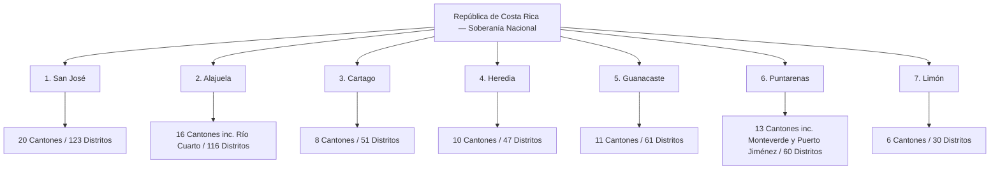

# Costa Rica Unidos — Plataforma Territorial Soberana

[](https://react.dev/)
[](https://costaricaunidos.cr)
[](https://inec.cr)
[](https://costaricaunidos.cr)
[](https://www.w3.org/WAI/WCAG21/quickref/)
[](https://pgrweb.go.cr)
[](https://web.dev/progressive-web-apps/)

Plataforma digital integral para la soberanía ciudadana, transparencia presupuestaria, fiscalización de obra pública, resiliencia ante emergencias nacionales, navegación territorial tridimensional e internacionalización reactiva en la República de Costa Rica.

---

## 📑 Tabla de Contenidos

1. [Visión General del Proyecto](#1-visión-general-del-proyecto)
2. [Módulos Cívicos Implementados](#2-módulos-cívicos-implementados)
   - [Módulo 01: Portal Nacional y Theming Soberano](#módulo-01-portal-nacional-y-theming-soberano)
   - [Módulo 02: Espacio Administrativo Cantonal y Repositorio de Actas](#módulo-02-espacio-administrativo-cantonal-y-repositorio-de-actas)
   - [Módulo 03: Identidad Cultural, Tradiciones e Himnos Cantonales](#módulo-03-identidad-cultural-tradiciones-e-himnos-cantonales)
   - [Módulo 04: Deportes y Gestión del CCDR](#módulo-04-deportes-y-gestión-del-ccdr)
   - [Módulo 05: Sistema GIS y Visor Cartográfico 3D Soberano](#módulo-05-sistema-gis-y-visor-cartográfico-3d-soberano)
   - [Módulo 06: Directorio Educativo y Vinculación con CTPs](#módulo-06-directorio-educativo-y-vinculación-con-ctps)
   - [Módulo 07: Sistema de Reportes Ciudadanos e Incidencias Viales](#módulo-07-sistema-de-reportes-ciudadanos-e-incidencias-viales)
   - [Módulo 08: Comercio Local, PYMES y Feria del Agricultor](#módulo-08-comercio-local-pymes-y-feria-del-agricultor)
   - [Módulo 09: Guía de Turismo Cantonal Sostenible y Accesible](#módulo-09-guía-de-turismo-cantonal-sostenible-y-accesible)
   - [Módulo 10: Seguridad Ciudadana, Gestión del Riesgo y Modo Resiliencia Offline](#módulo-10-seguridad-ciudadana-gestión-del-riesgo-y-modo-resiliencia-offline)
   - [Módulo 11: Participación Ciudadana y Presupuesto Participativo](#módulo-11-participación-ciudadana-y-presupuesto-participativo)
   - [Módulo 12 / RF-12.1: Búsqueda Semántica Geoespacial con NLP y Voz](#módulo-12--rf-121-búsqueda-semántica-geoespacial-con-nlp-y-voz)
   - [Módulo 12 / RF-12.2: Planificador Generativo 'Itinerario Pura Vida' con Análisis Topográfico 3D](#módulo-12--rf-122-planificador-generativo-itinerario-pura-vida-con-análisis-topográfico-3d)
   - [Consolidación de Datasets Geoespaciales POI para Capas GIS](#consolidación-de-datasets-geoespaciales-poi-para-capas-gis)
   - [Motor de Accesibilidad Universal (RNF-05 / Ley N° 7600)](#motor-de-accesibilidad-universal-rnf-05--ley-n-7600)
   - [Foro Tico y Supervisor IA de Moderación](#foro-tico-y-supervisor-ia-de-moderación)
   - [Noticias, Perfil Ciudadano y Portal del Ciudadano](#noticias-perfil-ciudadano-y-portal-del-ciudadano)
   - [Administración, Roles y Base de Datos Local](#administración-roles-y-base-de-datos-local)
   - [Tema Claro/Oscuro con Tokens Semánticos](#tema-claroscuro-con-tokens-semánticos)
3. [Arquitectura del Sistema y Flujo de Datos](#3-arquitectura-del-sistema-y-flujo-de-datos)
4. [Estructura del Proyecto](#4-estructura-del-proyecto)
5. [Jerarquía Territorial Oficial de Costa Rica](#5-jerarquía-territorial-oficial-de-costa-rica)
6. [Sistema de Diseño: Sovereign Civic Glass v2.1](#6-sistema-de-diseño-sovereign-civic-glass-v21)
7. [Matriz de Personas: Eiker vs Alanie](#7-matriz-de-personas-eiker-vs-alanie)
8. [Instalación y Puesta en Marcha](#8-instalación-y-puesta-en-marcha)
9. [Gobernanza, DevOps y Flujo GitFlow](#9-gobernanza-devops-y-flujo-gitflow)
10. [Marco Normativo y Cumplimiento Legal](#10-marco-normativo-y-cumplimiento-legal)

---

## 1. Visión General del Proyecto

**Costa Rica Unidos** es una suite tecnológica de ingeniería de software cívico concebida para cerrar la brecha entre la ciudadanía y las instituciones del Estado. Su objetivo primordial es brindar un entorno unificado, accesible, auditable y transparente donde converjan:

- **Fiscalización ciudadana activa**: Trazabilidad y seguimiento en tiempo real de licitaciones, avance de obras públicas e incidencias viales.
- **Navegación territorial fotorrealista**: Modelado 3D interactivo del relieve nacional, volcanes, valles y cordilleras con geocercado perimetral estricto.
- **Resiliencia ante emergencias nacionales**: Botonera táctil SOS de acceso instantáneo, cintillo oficial de telemetría de alertas de la Comisión Nacional de Emergencias (CNE) y soporte offline total garantizado mediante Progressive Web Apps (PWA).
- **Inteligencia artificial cívica y accesibilidad universal**: Procesamiento de lenguaje natural costarricense en cliente, dictado por voz y lectura de pantalla multilingüe con soporte para lenguas indígenas autóctonas.
- **Soberanía y transparencia municipal**: Acceso a actas del Concejo Municipal, historia y heráldica cantonal, catálogo deportivo CCDR, vinculación con colegios técnicos (CTP), apoyo a PYMES locales con verificación tributaria ante el Ministerio de Hacienda, ferias del agricultor y democracia directa mediante presupuesto participativo blindado.

---

## 2. Módulos Cívicos Implementados

### Módulo 01: Portal Nacional y Theming Soberano
- **Ruta**: `/` e `/inicio`
- **Capacidades**:
  - **Theming Engine Provincial Dinámico**: Inyección de tokens cromáticos `--province-primary` y `--glow-provincial` según la provincia activa, reflejando las identidades cantonales y patrias.
  - **Selector Territorial en Cascada (DTA Oficial)**: Despliegue anidado de `Provincia` ➔ `Cantón` (84 cantones, incluyendo Río Cuarto, Monteverde y Puerto Jiménez) ➔ `Distrito` (492 distritos), con persistencia automática en `localStorage`.
  - **Hero Carousel Tricolor**: Carrusel institucional interactivo accesible con controles de pausa, telemetría técnica en vivo y enlaces rápidos a servicios cívicos.
  - **Cajón Flotante Territorial (Drawer)**: Exploración rápida de códigos postales y datos demográficos por distrito.
  - **Búsqueda Predictiva con Atajo de Teclado**: Acceso global mediante `Ctrl + K`.
  - **Sistema de Internacionalización Reactiva (8 Idiomas Oficiales)**:
    * Selector dinámico integrado en el menú a pantalla completa (`FullScreenMenu.jsx`) con soporte para 8 banderas e idiomas: `CR` (Español Costa Rica), `ES` (Español España), `US` (Inglés), `CN` (Chino Mandarín), `BR` (Portugués), `FR` (Francés), `RU` (Ruso) y `JP` (Japonés).
    * Traducción en tiempo real sin recarga de página del Hero, buscador semántico, botón de exploración, los 11 módulos nacionales y las métricas territoriales (`07 Provincias`, `84 Cantones`, `492 Distritos`).
    * Persistencia automática de la preferencia lingüística en `localStorage` (`idioma_preferido`).
    * Sincronización bidireccional inmediata con el motor de voz asistida Web Speech API TTS (`VoiceReaderFloatingButton.jsx`).

### Módulo 02: Espacio Administrativo Cantonal y Repositorio de Actas
- **Ruta**: `/gobernanza`
- **Componentes**: `src/pages/GobernanzaPage.tsx` y `src/components/gobernanza/`
- **Capacidades**:
  - **Organigrama Municipal Jerárquico e Interactivo** (`OrganigramaMunicipal.tsx`): Vista colapsable por niveles de dependencias cantonales (Alcaldía, Concejo Municipal, Auditoría Interna, Direcciones Operativas y Servicios Comunitarios), con datos de contacto oficial y jerarquías transparentes.
  - **Tabla Paginada de Actas del Concejo Municipal** (`TablaActas.tsx`): Catálogo histórico con filtros por año (2024–2026), tipo de sesión (Ordinaria o Extraordinaria) y motor de búsqueda por palabras clave en temas abordados.
  - **Visor Modal Accesible de Actas** (`VisorActaModal.tsx`): Previsualización formal en documento PDF embebido, resumen de acuerdos municipales tomados, votos emitidos y descarga directa del documento original.

### Módulo 03: Identidad Cultural, Tradiciones e Himnos Cantonales
- **Ruta**: `/cultura`
- **Componentes**: `src/pages/CulturaPage.tsx` y `src/components/cultura/`
- **Capacidades**:
  - **Línea de Tiempo Histórica Cantonal** (`TimelineHistorico.tsx`): Hitos fundacionales, declaratorias de villa, cantonato y evolución socioeconómica con tarjetas glassmórficas cronológicas.
  - **Galería Heráldica de Símbolos** (`GaleriaSimbolos.tsx`): Evolución histórica, simbología cívica y descripción heráldica de escudos y banderas cantonales oficiales.
  - **Reproductor Multimedia de Himnos Cantonales** (`HimnoPlayer.tsx`): Reproductor con visualizador dinámico de barras de audio en Canvas/SVG, transcripción sincronizada de la letra oficial, créditos de autoría musical/lírica y control accesible por teclado.
  - **Patrimonio Inmaterial y Lightbox Cultural** (`PatrimonioLightbox.tsx`): Catálogo visual de mascaradas tradicionales, fiestas patronales, leyendas autóctonas y cimarronas con visualizador ampliado a pantalla completa.

### Módulo 04: Deportes y Gestión del CCDR
- **Ruta**: `/deportes`
- **Componentes**: `src/pages/DeportesPage.tsx` y `src/components/deportes/`
- **Capacidades**:
  - **Catálogo de Escuelas Deportivas Formativas**: Directorio de disciplinas del Comité Cantonal de Deportes y Recreación (fútbol, natación, atletismo, baloncesto, voleibol, taekwondo, gimnasia), horarios, edades admitidas y requisitos de inscripción.
  - **Fichas de Instalaciones con Semáforo Operativo** (`FichaInstalacion.tsx`): Monitoreo en tiempo real del estado de recintos (estadios, polideportivos, canchas multiuso) mediante `StatusPill` (Verde = Abierto/Disponible, Amarillo = Mantenimiento/Cupo Limitado, Rojo = Ocupado/Alquiler Exclusivo).
  - **Muro Comunitario "Orgullo Cantonal"**: Panel de atletas destacados, medallero local en Juegos Deportivos Nacionales y feed cívico de eventos deportivos y recreativos.

### Módulo 05: Sistema GIS y Visor Cartográfico 3D Soberano
- **Ruta**: `/mapa-gis`
- **Capacidades**:
  - **Google Maps JavaScript API v3 (WebGL / 3D Platform)**: Renderizado fotorrealista con texturizado de relieve, volcanes y topografía nacional.
  - **Geofencing Soberano Estricto**: Restricción matemática infranqueable (`restriction.latLngBounds`) que limita el paneo y cámara a las fronteras terrestres y aguas patrimoniales de Costa Rica (incluyendo la delimitación insular de la Isla del Coco: Lat 5.53°, Lng -87.07°).
  - **Controles de Cámara 3D y Vuelos Órbita**: Inclinación variable (tilt 45°-60°), rotación azimutal y animaciones suaves (*fly-to*) hacia cualquier provincia seleccionada.
  - **Panel Multicapa Flotante de 5 Dimensiones Cívicas**:
    1. 🏥 *Salud*: EBAIS, Clínicas Integradas y Hospitales de la CCSS.
    2. 👮 *Seguridad*: Comisarías y Delegaciones de la Fuerza Pública.
    3. 🛡️ *Gestión del Riesgo*: Albergues temporales oficiales de la CNE.
    4. 🎓 *Educación*: Colegios Técnicos, Escuelas y Liceos del MEP.
    5. 🚧 *Infraestructura Vial*: Proyectos de obra y rutas nacionales MOPT / CONAVI.
  - **Tarjetas de Detalle Modal con Deep-Linking**: Telemetría técnica en tipografía `JetBrains Mono` con enlaces directos a Waze y Google Maps.

### Módulo 06: Directorio Educativo y Vinculación con CTPs
- **Ruta**: `/educacion`
- **Componentes**: `src/pages/EducacionPage.tsx` y `src/components/educacion/`
- **Capacidades**:
  - **Directorio Cantonal de Centros Educativos** (`FichaCentroEducativo.tsx`): Escuelas primarias, liceos académicos y colegios técnicos profesionales (CTP) con georreferenciación WGS84, códigos presupuestarios MEP, badges de comedor estudiantil y accesibilidad Ley 7600.
  - **Malla Curricular Técnica Especializada**: Fichas de especialidades técnicas de CTPs (Desarrollo de Software, Ciberseguridad, Contabilidad y Finanzas, Mecatrónica, Electrotecnia) con horas de práctica supervisada y perfil de salida laboral.
  - **Bolsa de Vinculación y Pasantías Locales**: Enlace directo entre egresados técnicos y PYMES cantonales verificadas.

### Módulo 07: Sistema de Reportes Ciudadanos e Incidencias Viales
- **Ruta**: `/reportar-incidencia`
- **Capacidades**:
  - **Asistente Guiado de 4 Pasos (Stepper)**:
    - *Paso 1 (Tipología del Daño)*: Selección visual de categoría (Hueco vial/bache en asfalto, Luminaria pública apagada o dañada, Fuga de agua potable/alcantarilla colapsada, Basurero clandestino).
    - *Paso 2 (Evidencia Fotográfica y Privacidad)*: Captura de fotos con selector de archivo o cámara, previsualización interactiva y consentimiento de protección de datos.
    - *Paso 3 (Georreferenciación Exacta)*: Selección de ubicación interactiva con pin GPS sobre mapa cartográfico y selector distrital.
    - *Paso 4 (Confirmación y Radicado)*: Resumen formal, emisión de identificador cívico `CR-2026-XXXX` y generación de comprobante.
  - **Compresión de Imágenes en Cliente (< 1 MB)**: Conversión automática al estándar WebP en `imageCompressor.js`.
  - **Sanitización Forzosa de Metadatos EXIF (Ley N° 8968)**: Destrucción de metadatos GPS satelitales y de identificación de cámara en Canvas antes de almacenar o transferir datos.
  - **Tablero de Trazabilidad de Tickets (Kanban)**: Monitoreo transparente en 4 fases (*En Revisión*, *Asignado*, *En Cuadrilla*, *Resuelto*) con buscador por radicado y exportación a PDF/JSON.

### Módulo 08: Comercio Local, PYMES y Feria del Agricultor
- **Rutas**: `/comercio` y `/feria-agricultor`
- **Componentes**: `src/pages/ComercioPage.tsx`, `src/pages/FeriaAgricultorPage.tsx` y `src/components/comercio/`
- **Capacidades**:
  - **Directorio de PYMES Verificadas ante el Ministerio de Hacienda** (`FichaComercio.tsx`):
    * Verificación en tiempo real mediante el endpoint oficial `https://api.hacienda.go.cr/fe/ae` (`haciendaService.ts`).
    * Sello visual "Comercio Formal Verificado Hacienda" y desplegado de actividad económica registrada.
    * Acciones directas a 1 toque (*Mobile-First*): Enlace a WhatsApp Business del comerciante y navegación GPS en Waze.
  - **Croquis Interactivo de la Feria del Agricultor** (`CroquisFeria.tsx`):
    * Plano vectorial SVG con zonificación cromática por sectores: Hortalizas y Verduras, Frutas de Temporada, Lácteos y Quesos Artesanales, Plantas Ornamentales y Cafetería Tradicional.
    * Selector interactivo de tramos/puestos con ficha de productor y formas de pago admitidas (SINPE Móvil, Efectivo, Tarjeta).
    * Calendario estacional de cosechas y productos frescos de la semana.

### Módulo 09: Guía de Turismo Cantonal Sostenible y Accesible
- **Ruta**: `/turismo`
- **Componentes**: `src/pages/TurismoPage.tsx` y `src/components/turismo/`
- **Capacidades**:
  - **Galería de Destinos Naturales y Patrimoniales** (`FichaDestinoTuristico.tsx`): Miradores, cataratas, senderos ecológicos, volcanes y reservas biológicas con visor modal de fotos de alta resolución.
  - **Badges Normados de Logística y Accesibilidad**:
    * ♿ **Ley 7600**: Senderos adaptados, rampas, señalética accesible y servicios sanitarios inclusivos.
    * 🚙 **Tracción 4x4 Requerida**: Caminos de lastre, pasos de río o pendientes pronunciadas.
    * 🐾 **Pet-Friendly**: Espacios que admiten animales de compañía.
  - **Rutas e Itinerarios Sugeridos Preconfigurados** (`RutasPreconfiguradas.tsx`):
    * *Ruta 1 Día — Patrimonio y Accesibilidad*: Itinerario histórico-cultural 100% transitable para personas con movilidad reducida.
    * *Ruta 2 Días — Alta Montaña y Aventura*: Circuito de ecoturismo y senderismo con indicación de tracción y equipo técnico.
  - **Exportador GeoJSON**: Generación y descarga directa del dataset geográfico de destinos turísticos cantonales.

### Módulo 10: Seguridad Ciudadana, Gestión del Riesgo y Modo Resiliencia Offline
- **Ruta**: `/seguridad-emergencias`
- **Capacidades**:
  - **Botonera Táctil SOS a Pantalla Completa**: Botones táctiles de gran formato ($\ge 54\text{px}$) con contraste ultra-alto y marcado telefónico directo mediante enlaces nativos `tel:` para:
    - `9-1-1`: Sistema de Emergencias Generales.
    - `Fuerza Pública`: Policía del Ministerio de Seguridad Pública.
    - `Bomberos`: Benemérito Cuerpo de Bomberos de Costa Rica.
    - `Cruz Roja`: Benemérita Cruz Roja Costarricense.
    - `OIJ`: Organismo de Investigación Judicial.
  - **Cintillo Oficial de Telemetría de Alertas CNE**: Telemetría en vivo con los cuatro niveles oficiales de la Comisión Nacional de Emergencias: Verde (Informativa), Amarilla (Precaución), Naranja (Peligro Inminente) y Roja (Evacuación Obligatoria).
  - **Directorio y Aforo de Albergues Temporales CNE**: Catálogo interactivo de albergues habilitados con indicación de capacidad máxima, personas albergadas y barra dinámica de aforo disponible.
  - **Arquitectura PWA Offline-First**:
    - Service Worker manual (`public/sw.js`) con estrategia Cache-First para recursos estáticos y assets cartográficos.
    - Gestor de sincronización offline (`offlineSyncService.js`): Almacenamiento seguro de reportes en cola local para sincronización diferida automática al restablecerse la red.

### Módulo 11: Participación Ciudadana y Presupuesto Participativo
- **Rutas**: `/participacion` y `/participacion/votar`
- **Componentes**: `src/pages/ParticipacionPage.tsx` y `src/components/participacion/`
- **Capacidades**:
  - **Banco de Proyectos Vecinales**: Catálogo de propuestas ciudadanas comunitarias (ciclovías, parques recreativos, iluminación solar, centros de acopio) con fichas técnicas, presupuestos estimados y distrito postulante.
  - **Sistema de Votación Blindado Antifraude** (`ModalVotacionAntifraude.tsx`):
    * Acceso exclusivo para rol *Ciudadano Verificado Nivel 2*.
    * Validación en tiempo real de la cédula de identidad ante el Ministerio de Hacienda (`api.hacienda.go.cr/fe/ae`).
    * **Principio Inviolable de 1 Voto por Cédula**: Verificación contra `VOTOS_REGISTRADOS_CEDULAS` que rechaza de inmediato cualquier intento de voto duplicado.
    * Emisión de recibo criptocívico inmutable con hash de auditoría (`CRU-XXX-POA26`) sin persistencia de datos personales sensibles (Ley N° 8968).
  - **Escrutinio en Tiempo Real y Distribución Presupuestaria** (`GraficoPresupuestoParticipativo.tsx`):
    * Gráficos reactivos SVG a 60fps sin dependencias externas pesadas.
    * Visualización de la partida presupuestaria comunal (₡ 307.000.000) y porcentaje de votos alcanzado por proyecto.
  - **Buzón Ciudadano de Audiencias Públicas** (`BuzonAudienciaModal.tsx`): Canal formal de radicación de peticiones ciudadanas ante el Concejo Municipal con confirmación digital.

### Módulo 12 / RF-12.1: Búsqueda Semántica Geoespacial con NLP y Voz
- **Componentes**: `src/components/gis/SemanticGeoSearchBar.jsx` y `src/services/geoSemanticNlpService.js`
- **Capacidades**:
  - **Pipeline de Procesamiento de Lenguaje Natural en Cliente**:
    - Tokenización, normalización fonética y análisis semántico de consultas cívicas en español costarricense (ej. *"clínicas cerca de colegios técnicos en San Carlos"*, *"albergues habilitados si se inunda Parrita"*, *"bretes viales en Cartago"*).
    - Extracción instantánea de entidades geográficas (84 cantones, 7 provincias, distritos) y clasificación de capas temáticas requeridas.
  - **Dictado por Voz Accesible**: Integración con Web Speech API (`webkitSpeechRecognition`) configurado en dialecto costarricense (`es-CR`).
  - **Transición Cartográfica 3D Reactiva**: Vuelo de cámara animado (*fly-to*) hacia las coordenadas extraídas y activación de resplandor visual temático (`--glow-provincial`).
  - **Cajón Flotante de Resultados**: Despliegue lateral (`NlpResultsDrawer.jsx`) con tarjetas de puntos de interés filtrados, distancias y botones de navegación.

### Módulo 12 / RF-12.2: Planificador Generativo 'Itinerario Pura Vida' con Análisis Topográfico 3D
- **Ruta**: `/itinerario-ia`
- **Componentes**: `src/pages/ItinerarioIAPage.tsx`, `src/components/itinerario/` y `src/services/itinerarioIAPlanner.ts`
- **Capacidades**:
  - **Formulario Generativo Multivariable** (`FormularioItinerarioIA.tsx`):
    * Parámetros ajustables: Duración (1 a 3 días), presupuesto diario en colones (Económico ₡ 15.000, Medio ₡ 35.000, Premium ₡ 75.000+), tipo de vehículo/tracción (4x2 Urbano o 4x4 Todoterreno), restricción estricta de movilidad reducida (Ley 7600) e inclusión de ferias del agricultor activas.
  - **Motor de Optimización y Ruteo Inteligente** (`itinerarioIAPlanner.ts`):
    * Selección heurística de actividades combinando atractivos turísticos, comercios PYME y ferias agrícolas según el presupuesto y accesibilidad.
    * Generación de cronograma diario con tiempos de desplazamiento, actividades sugeridas y costos desglosados.
    * Enlaces deep-linking directos para abrir cada parada en Waze y Google Maps (`VisorItinerarioGenerado.tsx`).
  - **Análisis Topográfico de Pendientes y Perfil de Elevación 3D** (`PerfilElevacion3D.tsx`):
    * Trazado interactivo SVG del perfil altimétrico de la ruta (metros sobre el nivel del mar).
    * Cálculo de pendientes máximas: Certificación de accesibilidad universal si la pendiente es $\le 8\%$ (Ley 7600) o activación de advertencia de tracción 4x4 si la pendiente supera el $16\%$.

### Consolidación de Datasets Geoespaciales POI para Capas GIS
- **Archivo**: `src/data/poiDatasets.ts`
- **Capacidades**:
  - Normalización unificada de puntos de interés de Educación, Comercio PYME, Turismo y Deportes bajo el contrato estandarizado:
    ```typescript
    { id: string, name: string, category: POICategory, canton: string, lat: number, lng: number, details: object }
    ```
  - Función de exportación cartográfica `toGeoJSONFeatureCollection()` lista para consumo directo en visores cartográficos (Google Maps, Leaflet, MapLibre).

### Motor de Accesibilidad Universal (RNF-05 / Ley N° 7600)
- **Componentes**: `src/components/accessibility/`
- **Capacidades**:
  - **Selector de Escala Tipográfica en 4 Fases**:
    * *Fase 1*: 100% (Tamaño estándar).
    * *Fase 2*: 125% (Lectura cómoda).
    * *Fase 3*: 150% (Adultos mayores o baja visión leve).
    * *Fase 4*: 200% (Máxima accesibilidad visual, donde las áreas táctiles crecen automáticamente a un mínimo de 64px de alto).
    * Inyección de variable CSS `--text-scale` sin desbordamiento horizontal en pantallas móviles (360px de ancho).
  - **Sintetizador de Voz y Lector de Pantalla Flotante**:
    * Web Speech API (`SpeechSynthesis`) con soporte para 8 idiomas: Español, Bribri, Cabécar, Maleku, Guaymí, Inglés, Francés y Mandarín.
    * Conmutación entre voces femenina y masculina.
  - **Inducción Interactiva Guiada por Voz**: Modal de inducción en 3 pasos con locución de bienvenida y transcripción sincronizada de subtítulos en vivo.

### Foro Tico y Supervisor IA de Moderación
- **Ruta**: `/foro` | **Componentes**: `src/pages/ForoPage.jsx`, `src/components/foro/`
- **Capacidades**:
  - Publicaciones, comentarios, votos y reacciones con persistencia en `foro_posts`.
  - **Moderación pre-publicación en dos capas**: filtro local determinista con léxico costarricense y lista blanca cívica (`src/config/lexicoModeracion.js`) y clasificación opcional con Gemini (`geminiService.js`, `moderacionForoService.js`).
  - **Sanciones graduales** (`src/config/reglasForo.js`): advertencia, baneos de 24 h a indefinido y caducidad de faltas leves a los 90 días; derecho a apelación.
  - Modal de "Reglas de la Comunidad" con aceptación de primer uso y panel de supervisión exclusivo para Super Administrador.

### Noticias, Perfil Ciudadano y Portal del Ciudadano
- **Rutas**: `/noticias`, `/perfil` y portal ciudadano (`src/pages/NoticiasPage.jsx`, `PerfilPage.tsx`, `PortalCiudadanoPage.tsx`)
- **Capacidades**: publicación y detalle de noticias con control por rol (`src/components/noticias/`), perfil de usuario con datos y solicitudes de emprendedor (`solicitudes_emprendedor`) y portal con acceso a los servicios cívicos del usuario autenticado.

### Administración, Roles y Base de Datos Local
- **Componentes**: `src/pages/Dashboard.jsx`, `ProvincialAdminDashboard.jsx`, `src/components/admin/`
- **Capacidades**:
  - **RBAC centralizado** en `src/config/roles.ts` y `navigationRoles.ts`, con `PrivateRoutes.jsx` y página `AccessDenied.jsx`.
  - **Alta y baja de usuarios** con validación de cédula ante Hacienda (`adminService.ts`, `userService.ts`) y bitácora de auditoría (`bitacoraAuditoria`).
  - **`db.json` + json-server** (puerto 3001) como base de datos local de desarrollo, consumida vía `dbClient.ts` / `dbService.ts`. Colecciones: `usuarios`, `solicitudesComercio`, `incidenciasViales`, `alberguesCNE`, `proyectosPresupuesto`, `votosEmitidos`, `bitacoraAuditoria`, `foro_posts`, `noticias`, `sanciones_foro`, `moderacionContenido`, entre otras.
  - Solo para desarrollo y demostración: ver limitaciones en [SECURITY.md](SECURITY.md).

### Tema Claro/Oscuro con Tokens Semánticos
- **Archivos**: `src/index.css`, `src/context/ThemeContext.jsx`, `src/styles/themeEngine.ts`
- **Capacidades**:
  - Tokens `--cru-surface`, `--cru-border`, `--cru-text*`, `--cru-accent-*` definidos en `:root` (oscuro) y `html.light` (claro) con contraste WCAG 2.1 AA.
  - Migración por fases 4A–4D: portal, provincias, componentes comunes y tokenización de colores hardcodeados en páginas y componentes.
  - El tema inicial por defecto es `dark`. Ver detalles en [CHANGELOG.md](CHANGELOG.md).

---

## 3. Arquitectura del Sistema y Flujo de Datos

```mermaid
graph TD
    subgraph Presentation [Capa de Presentación — Sovereign Civic Glass v2.1]
        A1[Navbar Institucional & FullScreenMenu]
        A2[Portal Nacional M01]
        A3[Gobernanza y Actas M02]
        A4[Cultura e Himnos M03]
        A5[Deportes CCDR M04]
        A6[Visor GIS 3D M05]
        A7[Educación y CTPs M06]
        A8[Reportes Stepper M07]
        A9[Comercio PYMES y Feria M08]
        A10[Turismo Accesible M09]
        A11[Emergencias SOS y Albergues M10]
        A12[Participación y Votación Blindada M11]
        A13[Búsqueda Semántica M12.1]
        A14[Planificador Itinerario IA M12.2]
        A15[Suite Atómica Civic Glass: Button, Card, Badge, Modal, StatusPill]
    end

    subgraph Intelligence [Capa de Inteligencia y Procesamiento en Cliente]
        B1[Motor NLP Semántico Geoespacial - geoSemanticNlpService]
        B2[Web Speech Recognition es-CR]
        B3[Web Speech Synthesis TTS Multilingüe]
        B4[Image Compressor WebP & EXIF Stripper - Ley 8968]
        B5[Motor Heurístico 'Itinerario Pura Vida' - itinerarioIAPlanner]
        B6[Certificación Topográfica 3D - PerfilElevacion3D]
    end

    subgraph ServicesAndSecurity [Capa de Servicios, Identidad y Seguridad]
        S1[API Ministerio de Hacienda api.hacienda.go.cr/fe/ae]
        S2[Caché SWR con Revalidación en Segundo Plano - swrCache]
        S3[Blindaje Antifraude 1 Voto por Cédula Activa - M11]
        S4[Motor i18n Reactivo en Cliente con Glosario Tico]
    end

    subgraph GeoData [Capa Geoespacial y Plataforma 3D]
        C1[Google Maps JavaScript API v3 - WebGL Platform]
        C2[Geofencing Soberano Costa Rica + Isla del Coco]
        C3[Datasets POI Consolidados - poiDatasets.ts GeoJSON]
        C4[Camera Controls Tilt 45-60° & Fly-to]
    end

    subgraph Resilience [Capa de Resiliencia y Almacenamiento Local]
        D1[Service Worker Cache-First sw.js]
        D2[Cola de Sincronización Offline - offlineSyncService]
        D3[Persistencia Territorial localStorage / IndexedDB]
        D4[Telemetría CNE en Vivo]
    end

    Presentation --> Intelligence
    Presentation --> ServicesAndSecurity
    Presentation --> GeoData
    Presentation --> Resilience
    Intelligence --> GeoData
    ServicesAndSecurity --> Presentation
    GeoData --> Resilience
```



---

## 4. Estructura del Proyecto

```text
CostaRicaUnidos-Plataforma-Web-Integral/
├── .env                              # Variables de entorno locales (API keys)
├── .env.example                      # Plantilla de variables de entorno requeridas
├── .gitignore                        # Exclusiones de Git (node_modules, dist, .env)
├── Agent.md                          # Directrices de gobernanza cívica y memoria de IA
├── CHANGELOG.md                      # Registro de cambios formal (Keep a Changelog / SemVer)
├── CONTRIBUTING.md                   # Guía de contribución, GitFlow y estándares cívicos
├── index.html                        # Punto de entrada HTML5 con metadatos de SEO y PWA
├── package.json                      # Configuración de dependencias y scripts de npm
├── README.md                         # Documentación técnica maestra del proyecto
├── SECURITY.md                       # Políticas de ciberseguridad y cumplimiento Ley N° 8968
├── vite.config.js                    # Configuración de empaquetado y plugins de Vite
├── public/
│   ├── favicon.ico                   # Favicon clásico multiplataforma
│   ├── favicon.svg                   # Favicon vectorial con isotipo transparente
│   ├── logo.png                      # Isotipo oficial de alta resolución con transparencia
│   ├── manifest.webmanifest          # Manifiesto de aplicación PWA (instalabilidad)
│   └── sw.js                         # Service Worker con estrategia de caché offline
└── src/
    ├── App.jsx                       # Componente orquestador con Providers globales
    ├── main.jsx                      # Punto de renderizado en el DOM de React 18
    ├── index.css                     # Sistema de estilos Sovereign Civic Glass v2.1
    ├── serviceWorkerRegistration.js  # Registro y control de ciclo de vida del Service Worker
    ├── components/
    │   ├── FullScreenMenu.jsx        # Menú overlay con selector de 8 idiomas y 11 módulos
    │   ├── HeroCarousel.jsx          # Carrusel institucional tricolor
    │   ├── InteractiveSvgMap.jsx     # Mapa vectorial provincial SVG
    │   ├── Navbar.jsx                # Barra de navegación cívica con accesibilidad
    │   ├── PredictiveSearch.jsx      # Búsqueda territorial predictiva (Ctrl + K)
    │   ├── ProvincialThemeEngine.jsx # Inyector dinámico de tokens cromáticos provinciales
    │   ├── TerritorialDrawer.jsx     # Cajón deslizante de datos distritales
    │   ├── TerritorialSelector.jsx   # Selector en cascada (Provincia ➔ Cantón ➔ Distrito)
    │   ├── accessibility/            # Motor de accesibilidad universal (Ley 7600)
    │   │   ├── AccessibilityContext.jsx
    │   │   ├── TypographicScaleSelector.jsx
    │   │   ├── VoiceGuidedOnboardingModal.jsx
    │   │   ├── VoiceReaderFloatingButton.jsx
    │   │   ├── accessibilityData.js
    │   │   └── index.js
    │   ├── common/                   # Biblioteca de componentes atómicos Sovereign Civic Glass
    │   │   ├── AccessibilityBadge.tsx # Badges: Ley 7600, 4x4, Pet-Friendly
    │   │   ├── CivicBadge.tsx        # Etiqueta con variantes de estatus y alertas
    │   │   ├── CivicButton.tsx       # Botón táctil estándar con WCAG 2.1 AA
    │   │   ├── CivicCard.tsx         # Contenedor con 3 niveles de vidrio y resplandor
    │   │   ├── CivicModal.tsx        # Diálogo modal accesible con focus-trap
    │   │   ├── Logo.jsx              # Logotipo oficial (máx. 40px)
    │   │   ├── StatusPill.tsx        # Semáforo dinámico (Verde/Amarillo/Rojo)
    │   │   └── index.ts
    │   ├── gobernanza/               # M02 — Espacio Administrativo Cantonal y Actas
    │   │   ├── OrganigramaMunicipal.tsx
    │   │   ├── TablaActas.tsx
    │   │   ├── VisorActaModal.tsx
    │   │   └── index.ts
    │   ├── cultura/                  # M03 — Identidad Cultural, Tradiciones e Himnos
    │   │   ├── GaleriaSimbolos.tsx
    │   │   ├── HimnoPlayer.tsx
    │   │   ├── PatrimonioLightbox.tsx
    │   │   ├── TimelineHistorico.tsx
    │   │   └── index.ts
    │   ├── deportes/                 # M04 — Deportes y Gestión CCDR
    │   │   ├── FichaInstalacion.tsx
    │   │   └── index.ts
    │   ├── educacion/                # M06 — Directorio Educativo y CTPs
    │   │   ├── FichaCentroEducativo.tsx
    │   │   └── index.ts
    │   ├── comercio/                 # M08 — PYMES y Feria del Agricultor
    │   │   ├── CroquisFeria.tsx
    │   │   ├── FichaComercio.tsx
    │   │   └── index.ts
    │   ├── turismo/                  # M09 — Guía de Turismo Cantonal Sostenible
    │   │   ├── FichaDestinoTuristico.tsx
    │   │   ├── RutasPreconfiguradas.tsx
    │   │   └── index.ts
    │   ├── participacion/            # M11 — Presupuesto Participativo y Audiencias
    │   │   ├── BuzonAudienciaModal.tsx
    │   │   ├── GraficoPresupuestoParticipativo.tsx
    │   │   ├── ModalVotacionAntifraude.tsx
    │   │   └── index.ts
    │   ├── itinerario/               # M12.2 — Planificador Generativo 'Itinerario Pura Vida'
    │   │   ├── FormularioItinerarioIA.tsx
    │   │   ├── PerfilElevacion3D.tsx
    │   │   ├── VisorItinerarioGenerado.tsx
    │   │   └── index.ts
    │   ├── gis/                      # Visor cartográfico 3D y búsqueda NLP (M05 / M12.1)
    │   │   ├── CameraFlyControls.jsx
    │   │   ├── LayerControlPanel.jsx
    │   │   ├── MapaCartografico3D.jsx
    │   │   ├── NlpResultsDrawer.jsx
    │   │   ├── PointDetailCard.jsx
    │   │   ├── SemanticGeoSearchBar.jsx
    │   │   ├── darkMapStyles.js
    │   │   ├── gisLayersData.js
    │   │   └── index.js
    │   ├── reports/                  # Reportes de incidencias viales y tickets (M07)
    │   │   ├── Step1DamageType.jsx
    │   │   ├── Step2PhotoPrivacy.jsx
    │   │   ├── Step3Georeferencing.jsx
    │   │   ├── Step4Confirmation.jsx
    │   │   ├── TicketTraceabilityBoard.jsx
    │   │   ├── imageCompressor.js
    │   │   ├── ticketService.js
    │   │   └── index.js
    │   └── security/                 # Centro de seguridad, alertas SOS y CNE (M10)
    │       ├── AlberguesListMap.jsx
    │       ├── CneAlertRibbon.jsx
    │       ├── OfflineResilienceManager.jsx
    │       ├── SosKeypadFullscreen.jsx
    │       └── index.js
    ├── config/                       # Roles, navegación, temas provinciales y reglas del foro
    │   ├── roles.ts / roles.js
    │   ├── navigationRoles.ts / navigationRoles.js
    │   ├── provincialThemes.js
    │   ├── lexicoModeracion.js
    │   └── reglasForo.js
    ├── types/                        # Tipos TypeScript compartidos (admin.ts, auth.ts)
    ├── utils/                        # Utilidades (privacyUtils.ts)
    ├── context/
    │   ├── AuthContext.tsx / .jsx    # Sesión, roles y verificación de sanciones
    │   ├── CivicModalContext.jsx     # Orquestador global de modales cívicos
    │   ├── LanguageContext.jsx       # Contexto y diccionario reactivo para 8 idiomas oficiales
    │   └── ThemeContext.jsx          # Tema claro/oscuro
    ├── data/
    │   ├── poiDatasets.ts            # Datasets consolidados para capas GIS (GeoJSON)
    │   └── territorialData.js        # DTA oficial: 7 provincias, 84 cantones, distritos
    ├── hooks/
    │   ├── useDirectoryData.ts       # Hook de consumo con SWR
    │   └── useHaciendaValidation.ts  # Hook de validación tributaria con Hacienda
    ├── i18n/
    │   ├── costaRicaGlossary.ts      # Glosario de términos autóctonos costarricenses
    │   └── index.ts                  # Motor de internacionalización y formateo
    ├── pages/
    │   ├── ComercioPage.tsx          # Directorio de PYMES locales
    │   ├── CulturaPage.tsx           # Historia, símbolos e himnos cantonales
    │   ├── Dashboard.jsx             # Tablero de métricas cívicas y consola de navegación
    │   ├── DeportesPage.tsx          # Escuelas CCDR e instalaciones deportivas
    │   ├── EducacionPage.tsx         # Centros educativos y especialidades CTP
    │   ├── FeriaAgricultorPage.tsx   # Croquis y calendario de la feria comunal
    │   ├── GobernanzaPage.tsx        # Organigrama municipal y repositorio de actas
    │   ├── Inicio.jsx                # Portal de bienvenida y módulos cívicos
    │   ├── ItinerarioIAPage.tsx      # Planificador de viaje 'Itinerario Pura Vida'
    │   ├── Login.jsx                 # Acceso institucional autenticado
    │   ├── MapaGIS.jsx               # Página principal del visor cartográfico 3D
    │   ├── NotFound.jsx              # Vista de error 404 institucional
    │   ├── ParticipacionPage.tsx     # Presupuesto participativo y votación
    │   ├── ReportarIncidencia.jsx    # Asistente y trazabilidad de reportes viales
    │   ├── SeguridadEmergencias.jsx  # Centro de resiliencia y emergencias SOS
    │   ├── TurismoPage.tsx           # Guía turística cantonal accesible
    │   │   (además: ForoPage, NoticiasPage, PerfilPage, PortalCiudadanoPage,
    │   │    ProvincialAdminDashboard, FeriaPage y AccessDenied)
    ├── routes/
    │   ├── PrivateRoutes.jsx         # Protección de rutas por rol (RBAC)
    │   └── Routing.jsx               # Enrutador central con rutas públicas y privadas
    ├── services/
    │   ├── adminService.ts / userService.ts / crudService.ts  # Administración y CRUD
    │   ├── dbClient.ts / dbService.ts # Acceso a db.json vía json-server
    │   ├── foroService.js / moderacionForoService.js / geminiService.js
    │   ├── geoSemanticNlpService.js  # Motor NLP de búsqueda geoespacial semántica
    │   ├── haciendaService.ts        # Cliente oficial API Ministerio de Hacienda
    │   ├── itinerarioIAPlanner.ts    # Motor de ruteo e itinerarios inteligentes
    │   ├── offlineSyncService.js     # Gestor de cola y sincronización diferida
    │   ├── swrCache.ts               # Capa de caché nativo con revalidación
    │   └── ubicacionesService.js     # Proveedor de jerarquía territorial DTA
    └── styles/
        └── themeEngine.ts            # Motor dinámico de tokens y temas provinciales
```

---

## 5. Jerarquía Territorial Oficial de Costa Rica

La plataforma implementa con fidelidad absoluta la **División Territorial Administrativa (DTA)** oficial según las clasificaciones del Instituto Nacional de Estadística y Censos (INEC) y el Tribunal Supremo de Elecciones (TSE).



---

## 6. Sistema de Diseño: Sovereign Civic Glass v2.1

**Sovereign Civic Glass v2.1** es una evolución estética del *glassmorphism* concebida para plataformas estatales de alta confianza, transparencia semántica y legibilidad a la intemperie:

### Tríadas Cromáticas Provinciales:
| Provincia | Identidad Territorial | Token `--province-primary` | Token Secundario | Token Acento |
| :--- | :--- | :--- | :--- | :--- |
| **San José** | Saprissa / Metrópoli | `#601438` | `#FFFFFF` | `#1A1F36` |
| **Alajuela** | Liga Deportiva Alajuelense (LDA) | `#D31424` | `#111111` | `#FFFFFF` |
| **Heredia** | Club Sport Herediano (CSH) | `#FFC700` | `#D61B23` | `#181818` |
| **Cartago** | Club Sport Cartaginés (CSC) | `#0A3282` | `#FFFFFF` | `#3572C6` |
| **Guanacaste** | Asociación Deportiva Guanacasteca (ADG) | `#05853B` | `#DE1C24` | `#FFFFFF` |
| **Puntarenas** | Puntarenas F.C. (PFC) | `#F36717` | `#121212` | `#FFFFFF` |
| **Limón** | Limón F.C. / La Tromba del Caribe | `#349E35` | `#FFFFFF` | `#D89F18` |

### Niveles de Vidrio Esmerilado:
- **Nivel 1 (Superficie Base)**: `rgba(0, 16, 102, 0.65)` | `backdrop-filter: blur(16px)` | borde translúcido (12%).
- **Nivel 2 (Paneles Flotantes / Drawers)**: `rgba(0, 20, 137, 0.55)` | `backdrop-filter: blur(24px)` | borde translúcido (20%).
- **Nivel 3 (Modales Críticos / Diálogos SOS)**: `rgba(0, 8, 30, 0.85)` | `backdrop-filter: blur(32px)` | borde translúcido (28%).

---

## 7. Matriz de Personas: Eiker vs Alanie

| Dimensión | Eiker (El Auditor Tecnológico) | Alanie (La Emprendedora Comunitaria) |
| :--- | :--- | :--- |
| **Rol Cívico** | Auditor social, ingeniero de datos, fiscalizador de obra pública | Pequeña comerciante local, líder vecinal de distrito, promotora cívica |
| **Dispositivo Principal** | Estación de trabajo Desktop (múltiples monitores, alta resolución) | Smartphone (conexión móvil 4G/5G, pantalla táctil $\ge 54\text{px}$) |
| **Nivel Técnico** | Avanzado (analiza esquemas JSON, presupuestos y modelos 3D) | Práctico / Cotidiano (valora la inmediatez, simplicidad y claridad) |
| **Caso de Uso Primario** | Comparar costo de licitación pública vs avance físico volumétrico | Verificar comercios PYME en Hacienda, consultar actas, votar proyectos y ferias |
| **Uso de Google Maps 3D** | Inspección de malla 3D de obras públicas, pendientes y cuencas | Ubicar escuelas, centros deportivos CCDR, ferias y destinos accesibles |
| **Tolerancia a Fricción** | Media (dispuesto a usar filtros complejos y telemetría avanzada) | Nula (requiere acciones inmediatas a 1 toque: WhatsApp, Waze, 1 voto/cédula) |
| **Módulos Asignados** | M01, M05, M07, M10, M12.1 y Motor de Accesibilidad | M02, M03, M04, M06, M08, M09, M11, M12.2 y Datasets POI |
| **Estado de Implementación** | 100% Completo (Rama `feature/Eiker`) | 100% Completo (Rama `feature/Alanie`) |

---

## 8. Instalación y Puesta en Marcha

### Prerrequisitos
- **Node.js**: Versión 18.x LTS o superior.
- **npm**: Versión 9.x o superior.
- **Google Maps API Key**: Con las APIs *Maps JavaScript API* y *Geocoding API* habilitadas.

### Instrucciones de Instalación
1. Clonar el repositorio y acceder al directorio:
   ```bash
   git clone https://github.com/tu-organizacion/CostaRicaUnidos-Plataforma-Web-Integral.git
   cd CostaRicaUnidos-Plataforma-Web-Integral
   ```

2. Seleccionar la rama de trabajo según el alcance deseado:
   ```bash
   # Para desarrollo en los módulos cívicos y comunitarios:
   git checkout feature/Alanie

   # Para desarrollo en visor GIS 3D y auditoría técnica:
   git checkout feature/Eiker
   ```

3. Instalar dependencias del proyecto:
   ```bash
   npm install
   ```

4. Configurar las variables de entorno:
   Copie el archivo `.env.example` a `.env` y agregue su clave:
   ```bash
   cp .env.example .env
   ```
   *Contenido de `.env`:*
   ```env
   VITE_GOOGLE_MAPS_API_KEY=tu_clave_de_google_maps_aqui
   VITE_GEMINI_API_KEY=tu_clave_de_gemini_aqui   # opcional: moderación IA del foro
   ```

5. Iniciar el entorno local de desarrollo (frontend + base de datos `db.json`):
   ```bash
   npm run dev:all   # json-server en :3001 y Vite en :5173
   ```
   O por separado: `npm run server` (json-server, puerto 3001) y `npm run dev` (Vite). La aplicación se abrirá en `http://localhost:5173/`.

   > Si el repositorio está dentro de OneDrive y `git pull` falla al limpiar `.git/objects`, ejecute `git config gc.auto 0`. Ver [CONTRIBUTING.md](CONTRIBUTING.md).

6. Validar compilación de producción:
   ```bash
   npm run build
   ```

7. Previsualizar la compilación de producción:
   ```bash
   npm run preview
   ```

---

## 9. Gobernanza, DevOps y Flujo GitFlow

El proyecto implementa una disciplina estricta de control de versiones y gobernanza:

- **[Agent.md](Agent.md)**: Manual operativo de contexto, especificaciones del SRS v2.1 e instrucciones acumulativas para asistentes de Inteligencia Artificial.
- **[CHANGELOG.md](CHANGELOG.md)**: Registro histórico formal de versiones siguiendo los estándares de *Keep a Changelog* y *SemVer 2.0.0*.
- **[CONTRIBUTING.md](CONTRIBUTING.md)**: Guía detallada para desarrolladores, reglas de commits convencionales, biblioteca de componentes atómicos, esquema de POIs y estándares de accesibilidad.
- **[SECURITY.md](SECURITY.md)**: Políticas de ciberseguridad, blindaje electoral antifraude, minimización de datos personales y protocolo de divulgación coordinada de vulnerabilidades.

---

## 10. Marco Normativo y Cumplimiento Legal

| Ley o Estándar | Alcance en la Plataforma | Mecanismo de Verificación Técnica |
| :--- | :--- | :--- |
| **Ley N° 7600** | Igualdad de oportunidades y accesibilidad universal | Escala tipográfica en 4 fases (`--text-scale`), touch targets $\ge 54\text{px}$/$\ge 64\text{px}$, lector TTS multilingüe y certificación de pendientes topográficas peatonales $\le 8\%$ en `PerfilElevacion3D.tsx` |
| **Ley N° 8968** | Protección de la persona y sus datos personales | Sanitización forzosa en Canvas que elimina metadatos EXIF en `imageCompressor.js`, y consultas efímeras en memoria a la API de Hacienda sin persistir PII en `localStorage` |
| **Código Municipal / Hacienda** | Democracia directa y blindaje electoral de presupuesto participativo | Validación estricta de 1 voto por cédula legal activa contra `api.hacienda.go.cr/fe/ae` y registro inmutable en memoria con comprobante de auditoría `CRU-XXX-POA26` |
| **WCAG 2.1 AA** | Pautas internacionales de accesibilidad web | Ratios de contraste $\ge 4.5:1$, navegación total por teclado, foco visible y atributos WAI-ARIA completos en toda la suite atómica |
| **DTA Oficial** | Soberanía y delimitación territorial | Geofencing estricto de Costa Rica e Isla del Coco en Google Maps API y catálogo normalizado de 84 cantones |

---

*Desarrollado con rigor técnico, vocación patriótica y soberanía digital para el pueblo de la República de Costa Rica.*
